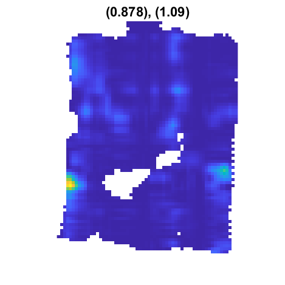
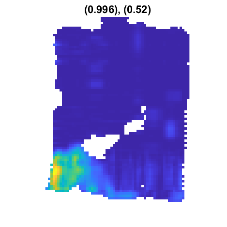

# GraphTucker

GraphTucker is a tool for discovering spatial components in spatial transcriptomics data using high-order analysis. GraphTucker is based on a graph-guilded Tucker Tensor Decomposition model optimized by a multiplicative updating algorithm for nonnegative decompoisition [^1]. The preprint and the supplementary document are available [here](https://github.com/kuanglab/GraphTucker/tree/main/document).

# An example of running GraphTucker on a mouse embryo Stereo-seq dataset and visualizing the resulting components

This repository provides code we used to run GraphTucker on a MOSTA Stereo-seq mouse embryo (day 9.5) dataset[^2] to obtain an imputed spatial gene expression tensor in Tucker form, and visualize the resulting spatial components. Please review the system and add-on requirements below. 

Figure A4 shows the Tucker decomposition of a spatial gene expression tensor into its components, which consists of a core tensor and three factor matrices (one for each mode). This decomposition is graph-regularized by a Cartesian product graph consisting of two spatial chain graphs and a PPI network as shown in Figure B. Figure C  demonstrates how the spatial component tensor can be constructed from the Tucker components. 

The code provided here demonstrates how to run GraphTucker on a spatial gene expression tensor to obtain graph-regularized Tucker components, and then visualizing the spatial components found.

We provide two walkthrough tutorials here. [Tutorial 1](https://github.com/kuanglab/GraphTucker/blob/main/README.md#tutorial-1-spatial-component-visualization-for-a-stereo-seq-mouse-embryo-dataset) demonstrates how to run GraphTucker on the Stereo-seq MOSTA 9.5 mouse embryo and visualize and save its spatial components. [Tutorial 2](https://github.com/kuanglab/GraphTucker/blob/main/README.md#tutorial-2-spatial-component-analysis-and-clustering-on-a-human-breast-cancer-dataset) demonstrates how to run GraphTucker on the Visium BRCA1 dataset, and perform spatial component analysis to find region-spatial-component matches given a ground truth annotated tissue and GraphTucker decomposition output. We also show how to run clustering on the output GraphTucker spatial component tensor.

If you want to run GraphTucker on your own data, please refer to the ['preprocessing_readme'](./preprocessing_readme.md) where we walkthrough how to download and process a Visium dataset from the 10x Genomics website, as well as download and process a Human PPI network from BioGRID to be used as input for GraphTucker.

## System and add-on requirements

Code for this mouse embryo dataset was tested on a machine with Linux (Ubuntu 20.04.6 LTS) with the following specifications:

CPU: Intel® Xeon® E52687W v33.10GHz, 25M Cache
Cores: 20
Memory: 256GB

Note that the necessary memory/RAM for running GraphTucker on the MOSTA_9.5 dataset is significantly lower - we observed ~13GB of memory being used during the algorithm itself, so we recommend at least 16GB of memory.

We use the most up to date MATLAB version R2023b for all implementations. 

MATLAB add-on requirements:
The only add-on needed is the Tensor Toolbox for MATLAB, Version 3.6[^3] (https://www.tensortoolbox.org/), which is included in the repository in the `GT_utils` folder.
  
# Tutorial 1: Spatial component visualization for a Stereo-seq mouse embryo dataset

## Step 1: Running GraphTucker to obtain imputed spatial gene expression tensor and Tucker components

GraphTucker can be run on the mouse embryo dataset by running the `GraphTucker_tutorial1.m` script. No changes in the file should be necessary to run this script, though make sure you have unzipped the MOSTA_9.5.zip file in the 'processed_data' folder. A mouse PPI network in the necessary MATLAB format is included with this data as well.

GraphTucker parameters are defaulted to rank=(64,64,64), lambda=0.1, with 1000 max iterations. Runtime for the MOSTA_9.5 dataset on our machine takes ~1-2 hours. The max iterations can be lowered to significantly reduce runtime, though the approximation error may suffer as a result.

## Step 2: Visualizing spatial components output by GraphTucker

To visualize the spatial components output by GraphTucker, run `visualize_GraphTucker_spatial_components.m` script in the 'analysis' folder. Again, ensure the path variables are correct, but the default parameters should be okay. This script will automatically save visualizations (as .pngs) of each spatial component into a distinct folder depending on the rank and lambda used. We include the spatial component images for MOSTA_9.5 obtained from running GraphTucker with the default parameters. Here are three example spatial components that show how they are visualized:

**Spatial component 1**

**Spatial component 15**

**Spatial component 60**

# Tutorial 2: Spatial component analysis and clustering on a Human breast cancer dataset

## Step 1: Running GraphTucker to obtain imputed spatial gene expression tensor and Tucker components

Similar to Tutorial 1, GraphTucker can be run on the mouse embryo dataset by running the `GraphTucker_tutorial2.m` script. No changes are necessary for this script. We have provided the BRCA1 data that can be used for this tutorial script in 'processed_data/BRCA1.zip', so make sure to unzip this folder. A Human PPI is included with this zip file as well. Tissue region annotations are also provided in 'aux_data/tissue_annotations/BRCA1_annotations.mat'

For analysis on this dataset, we recommend running GraphTucker with rank=(30, 30, 20), lambda=1, with 1000 max iterations (these are the default parameters). For other datasets, you may have to tune the rank. Tuning the x/y rank will affect the resolution (higher rank = higher resolution spatial components). Since we are trying to analyze how GraphTucker can capture 20 known regions, we set the the gene rank here to 20.

You can run now run this script, which should take 1-2 hours depending on your computer/server.

## Step 2: Analyzing results: finding spatial component matches and perform clustering

After GraphTucker finishes running, the output decomposition will be saved to 'res/BRCA1'. We also provide an example output file in 'res/BRCA1/GT_BRCA1_rank=30-30-20_lambda=1.mat_EXAMPLE.mat' that can be directly used for analysis, which we will use here.

The script we'll be runnning first is 'analyis/spatial_component_analysis.m'. If you are using you're own dataset, make sure the path variables are set correctly so the results from Step 1 can be found and loaded in. Otherwise for this tutorial, no changes are needed and it can be run as is. This script requires a regional annotation specific to a dataset - as previously mentioned, we provide one that can be used for the BRCA1 dataset that's being used in this tutorial.

This script will load in the GraphTucker decomposition computed in Step 1, and find the best spatial component matches to the given region annotations. It also will check a variety of top n% core tensor entries to see whether only taking a select number of top interactions can help find spatial component matches. This is determined by selecting the n% with the lowest avg. ED of its matched spatial components. After the best core tensor sparsity has been computed, we output each matched spatial component with its corresponding AUC and ED to 'vis/DATASET_NAME/spatial_component_matches' folder. Each image is saved with the region and the corresponding matched spatial component number in the filename.

The second script we run for this analysis is 'analysis/spatial_component_clustering.m' for clustering analysis. This script is similar to the previous in terms of preprocessing the output data, but we do not check different n% of core tensor entries and instead default to using all entries, since we observed best clustering ARI with this choice. After the decomposition is loaded and the spatial component tensor is constructed, we run k-means clustering on the spatial component tensor with k=num_regions (for this example, k=20). We then calculate the ARI between this resulting clustering and the tissue annotations as ground truth labels. The original annotated regions are saved as an image with a specific color mapping, and some additional processing is done to find a best color matching between the original region colors and the k-means clustering output. This is to provide a better visualization for identifying which clusterings best correspond to original regions. The original regions and the color mapped clusterings are both saved to the 'vis/BRCA1/clustering/' folder.

We've included the output images for the BRCA1 dataset in these folders already. Here are a few examples of the spatial component matches:

**Region 1 spatial component match**

**Region 10 spatial component match**

**Region 11 spatial component match**

And here are the clustering images:

**Ground truth clustering**

**Clustered spatial components**

## Clustering for baseline methods

We have provided a folder [baseline_clustering](https://github.com/kuanglab/GraphTucker/tree/main/baseline_clustering) containing scripts needed for generating clusterings for the four methods we used as baseline comparisons: NMF, RNMTF, FIST, NSFH. We also provide the resulting spatial components (post-processed to match tissue size and annotations) from each method to be directly used by the script that can be used to generate the clusterings presented in the manuscript. We will also provide code and/or commands necessary for running each of the baselines and any necessary post-processing scripts to align spot clusterings to the original tissues (coming soon).

## Final notes

All scripts have been commented throughout to provide some guidance at main steps. Regardless, if any questions or issues come up please feel free to leave comments or ask for help.

## References
[^1]: Deciphering High-order Structures in Spatial Transcriptomes with Graph-guided Tucker Decomposition, Charles Broadbent, Tianci Song and Rui Kuang, To Appear in the Proceedings of International Conference on Intelligent Systems for Molecular Biology (ISMB), July 12-16, 2024
[^2]: Chen, A., Liao, S., Cheng, M., Ma, K., Wu, L., Lai, Y., ... & Wang, J. (2022). Spatiotemporal transcriptomic atlas of mouse organogenesis using DNA nanoball-patterned arrays. Cell, 185(10), 1777-1792. DOI: 10.1016/j.cell.2022.04.003
[^3]: Brett W. Bader, Tamara G. Kolda and others, Tensor Toolbox for MATLAB, Version 3.6, www.tensortoolbox.org, September 28, 2023. 
[^4]: Stark, C., Breitkreutz, B. J., Reguly, T., Boucher, L., Breitkreutz, A., & Tyers, M. (2006). BioGRID: a general repository for interaction datasets. Nucleic acids research, 34(Database issue), D535–D539. https://doi.org/10.1093/nar/gkj109
